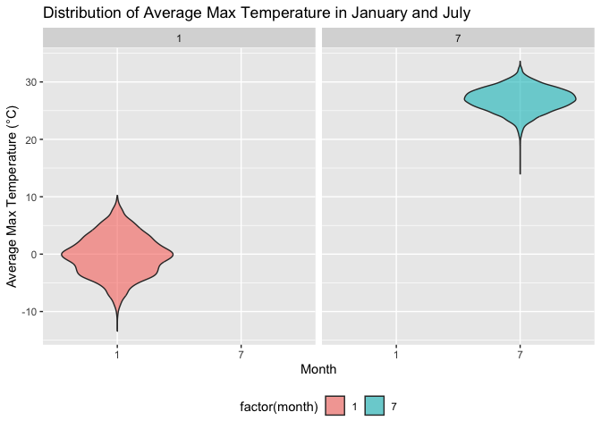
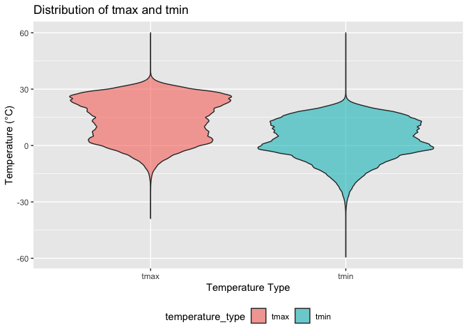
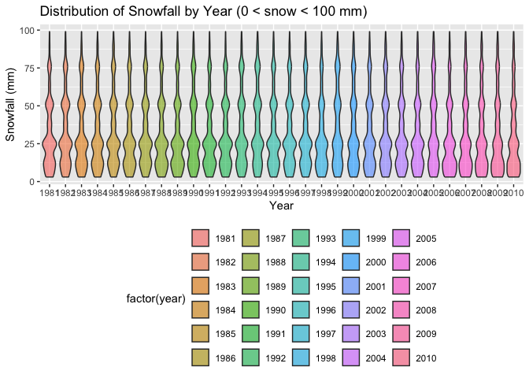
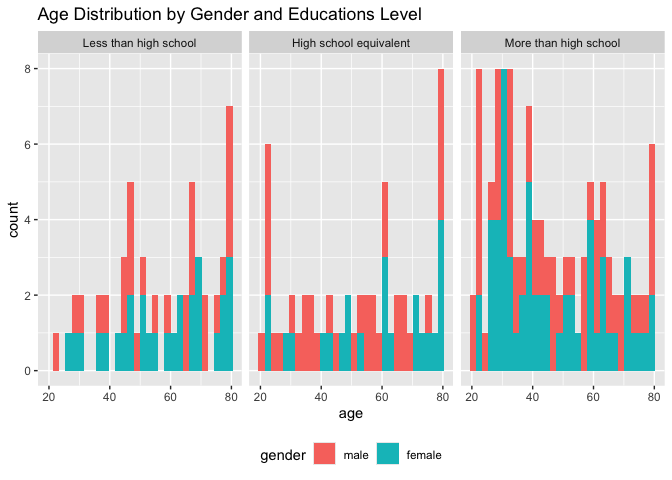
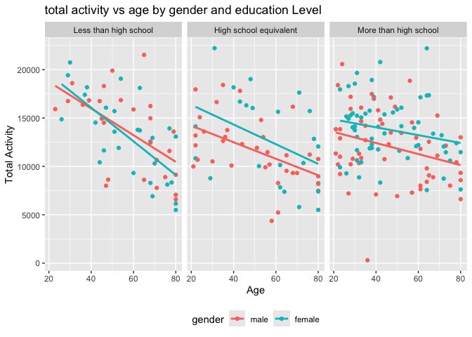
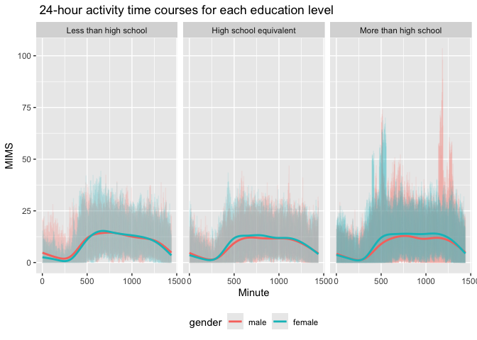
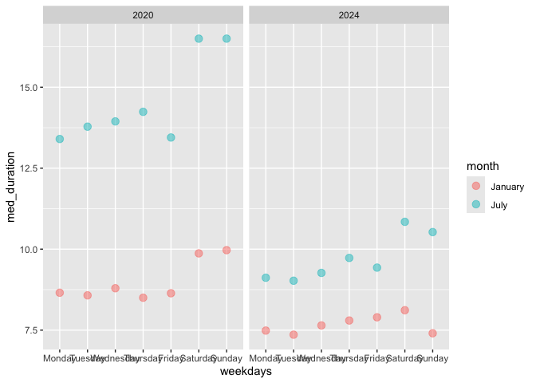
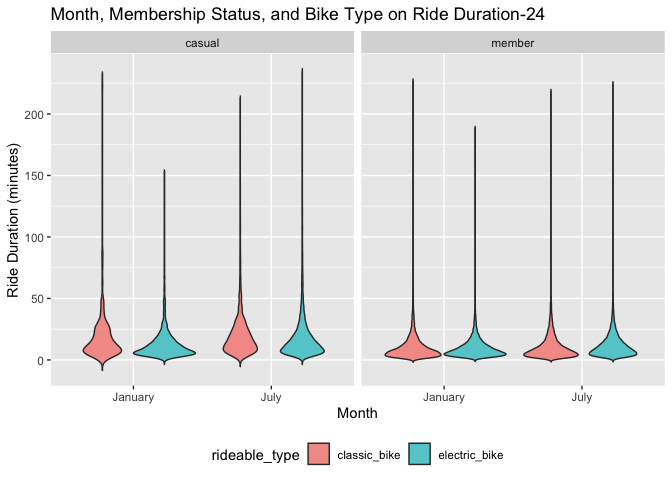

p8105_hw3_mz3084_meitong
================
Meitong Zhou
2024-10-05

``` r
library(tidyverse)
```

    ## ── Attaching core tidyverse packages ──────────────────────── tidyverse 2.0.0 ──
    ## ✔ dplyr     1.1.4     ✔ readr     2.1.5
    ## ✔ forcats   1.0.0     ✔ stringr   1.5.1
    ## ✔ ggplot2   3.5.1     ✔ tibble    3.2.1
    ## ✔ lubridate 1.9.3     ✔ tidyr     1.3.1
    ## ✔ purrr     1.0.2     
    ## ── Conflicts ────────────────────────────────────────── tidyverse_conflicts() ──
    ## ✖ dplyr::filter() masks stats::filter()
    ## ✖ dplyr::lag()    masks stats::lag()
    ## ℹ Use the conflicted package (<http://conflicted.r-lib.org/>) to force all conflicts to become errors

``` r
library(p8105.datasets)
data("ny_noaa")
```

## Q1

``` r
dim(ny_noaa)
```

    ## [1] 2595176       7

``` r
str(ny_noaa)
```

    ## tibble [2,595,176 × 7] (S3: tbl_df/tbl/data.frame)
    ##  $ id  : chr [1:2595176] "US1NYAB0001" "US1NYAB0001" "US1NYAB0001" "US1NYAB0001" ...
    ##  $ date: Date[1:2595176], format: "2007-11-01" "2007-11-02" ...
    ##  $ prcp: int [1:2595176] NA NA NA NA NA NA NA NA NA NA ...
    ##  $ snow: int [1:2595176] NA NA NA NA NA NA NA NA NA NA ...
    ##  $ snwd: int [1:2595176] NA NA NA NA NA NA NA NA NA NA ...
    ##  $ tmax: chr [1:2595176] NA NA NA NA ...
    ##  $ tmin: chr [1:2595176] NA NA NA NA ...
    ##  - attr(*, "spec")=
    ##   .. cols(
    ##   ..   id = col_character(),
    ##   ..   date = col_date(format = ""),
    ##   ..   prcp = col_integer(),
    ##   ..   snow = col_integer(),
    ##   ..   snwd = col_integer(),
    ##   ..   tmax = col_character(),
    ##   ..   tmin = col_character()
    ##   .. )

``` r
summary(ny_noaa)
```

    ##       id                 date                 prcp               snow       
    ##  Length:2595176     Min.   :1981-01-01   Min.   :    0.00   Min.   :  -13   
    ##  Class :character   1st Qu.:1988-11-29   1st Qu.:    0.00   1st Qu.:    0   
    ##  Mode  :character   Median :1997-01-21   Median :    0.00   Median :    0   
    ##                     Mean   :1997-01-01   Mean   :   29.82   Mean   :    5   
    ##                     3rd Qu.:2005-09-01   3rd Qu.:   23.00   3rd Qu.:    0   
    ##                     Max.   :2010-12-31   Max.   :22860.00   Max.   :10160   
    ##                                          NA's   :145838     NA's   :381221  
    ##       snwd            tmax               tmin          
    ##  Min.   :   0.0   Length:2595176     Length:2595176    
    ##  1st Qu.:   0.0   Class :character   Class :character  
    ##  Median :   0.0   Mode  :character   Mode  :character  
    ##  Mean   :  37.3                                        
    ##  3rd Qu.:   0.0                                        
    ##  Max.   :9195.0                                        
    ##  NA's   :591786

This data contains 2595176 rows and 7 columns, and the variables include
station id, date, prcp, snow, tmin and tmax.

``` r
ny_noaa = ny_noaa |>
  mutate(
    tmax = as.numeric(tmax), 
    tmin = as.numeric(tmin)   
  )
ny_noaa_df = ny_noaa |>
  mutate(
    year = as.numeric(substr(date, 1, 4)),  
    month = as.numeric(substr(date, 6, 7)),
    day = as.numeric(substr(date, 9, 10)),  
    prcp = prcp / 10,  # change unit into mm
    tmax = tmax / 10,  # change unit into Celsius
    tmin = tmin / 10   # change unit into Celsius
  )


head(ny_noaa_df)
```

    ## # A tibble: 6 × 10
    ##   id          date        prcp  snow  snwd  tmax  tmin  year month   day
    ##   <chr>       <date>     <dbl> <int> <int> <dbl> <dbl> <dbl> <dbl> <dbl>
    ## 1 US1NYAB0001 2007-11-01    NA    NA    NA    NA    NA  2007    11     1
    ## 2 US1NYAB0001 2007-11-02    NA    NA    NA    NA    NA  2007    11     2
    ## 3 US1NYAB0001 2007-11-03    NA    NA    NA    NA    NA  2007    11     3
    ## 4 US1NYAB0001 2007-11-04    NA    NA    NA    NA    NA  2007    11     4
    ## 5 US1NYAB0001 2007-11-05    NA    NA    NA    NA    NA  2007    11     5
    ## 6 US1NYAB0001 2007-11-06    NA    NA    NA    NA    NA  2007    11     6

``` r
# check the value of snowfall
ny_noaa_df |>
  count(snow) |>
  arrange(desc(n)) |>
  head()
```

    ## # A tibble: 6 × 2
    ##    snow       n
    ##   <int>   <int>
    ## 1     0 2008508
    ## 2    NA  381221
    ## 3    25   31022
    ## 4    13   23095
    ## 5    51   18274
    ## 6    76   10173

The most common value for Snow Amount is 0, probably because most dates
outside of winter do not snow.

``` r
average_tmax = ny_noaa_df |>
  filter(month %in% c(1, 7), !is.na(tmax)) |>
  group_by(id, year, month) |>
  summarise(average_tmax = mean(tmax, na.rm = TRUE), .groups = "drop") |>
  pivot_wider(
    names_from = month,
    values_from = average_tmax,
    names_prefix = "month_"
  )

head(average_tmax)
```

    ## # A tibble: 6 × 4
    ##   id           year month_1 month_7
    ##   <chr>       <dbl>   <dbl>   <dbl>
    ## 1 USC00300023  1981   -3.17    28.3
    ## 2 USC00300023  1982   -4.32    27.8
    ## 3 USC00300023  1983    1.11    29.8
    ## 4 USC00300023  1984   NA       27.2
    ## 5 USC00300023  1985   -1.30    NA  
    ## 6 USC00300023  1989   NA       27.1

``` r
colnames(average_tmax)
```

    ## [1] "id"      "year"    "month_1" "month_7"

``` r
average_tmax = average_tmax |>
  pivot_longer(
    cols = starts_with("month_"),
    names_to = "month",
    names_prefix = "month_",
    values_to = "average_tmax"
  ) |>
  mutate(month = as.numeric(month))
```

``` r
summary(average_tmax)
```

    ##       id                 year          month    average_tmax     
    ##  Length:8390        Min.   :1981   Min.   :1   Min.   :-13.4387  
    ##  Class :character   1st Qu.:1988   1st Qu.:1   1st Qu.: -0.2167  
    ##  Mode  :character   Median :1996   Median :4   Median :  8.6355  
    ##                     Mean   :1996   Mean   :4   Mean   : 13.3122  
    ##                     3rd Qu.:2004   3rd Qu.:7   3rd Qu.: 27.0032  
    ##                     Max.   :2010   Max.   :7   Max.   : 33.6000  
    ##                                                NA's   :249

``` r
average_tmax = average_tmax |>
  filter(!is.na(average_tmax))
```

``` r
ggplot(average_tmax, aes(x = factor(month), y = average_tmax, fill = factor(month))) +
  geom_violin(alpha = 0.6) + 
  facet_grid(~month) +
  labs(
    title = "Distribution of Average Max Temperature in January and July",
    x = "Month",
    y = "Average Max Temperature (°C)"
  ) +
  theme(legend.position = "bottom")
```

<!-- -->
rom the violin plot, we can see that the average maximum temperature in
January is concentrated between -10°C and 10°C, with a peak around 0°C.
The temperature in July is mainly concentrated around 25°C, with a
narrow distribution and no obvious outliers. There are not many extreme
changes in temperature throughout the year, but the temperature
difference between winter and summer is large.

``` r
temp_df = ny_noaa_df |>
  select(tmax, tmin) |>
  pivot_longer(cols = c(tmax, tmin), names_to = "temperature_type", values_to = "value") |>
  filter(!is.na(value))  


ggplot(temp_df, aes(x = temperature_type, y = value, fill = temperature_type)) +
  geom_violin(alpha = 0.6) +
  labs(
    title = "Distribution of tmax and tmin",
    x = "Temperature Type",
    y = "Temperature (°C)"
  ) +
  theme(legend.position = "bottom")
```

<!-- -->
The distribution of tmax is concentrated between 0°C and 30°C and is
biased to the right, indicating that the maximum temperature at some
observation stations exceeds 30°C. Some observations are close to -30°C,
suggesting freezing weather in the winter. The distribution of tmin is
mainly concentrated between -20°C and 10°C and is biased to the left,
indicating that the minimum temperature at many stations is below 0°C.
Both distributions show a small number of extreme values.

``` r
snow_df = ny_noaa_df |>
  filter(snow > 0 & snow < 100)
ggplot(snow_df, aes(x = factor(year), y = snow, fill = factor(year))) +
  geom_violin(alpha = 0.6) +
  labs(
    title = "Distribution of Snowfall by Year (0 < snow < 100 mm)",
    x = "Year",
    y = "Snowfall (mm)"
  ) +
  theme(legend.position = "bottom")
```

<!-- -->
The distribution of snowfall in the range of 0 to 100 mm is roughly
similar each year, but there are still some differences between
different years. Most years have snowfall concentrated in the range of
25 mm and less than 100 mm. Some years have large fluctuations in
snowfall (such as 1993 and 2008).

## Q2

``` r
accel_df = read_csv("data/nhanes_accel.csv")
```

    ## Rows: 250 Columns: 1441
    ## ── Column specification ────────────────────────────────────────────────────────
    ## Delimiter: ","
    ## dbl (1441): SEQN, min1, min2, min3, min4, min5, min6, min7, min8, min9, min1...
    ## 
    ## ℹ Use `spec()` to retrieve the full column specification for this data.
    ## ℹ Specify the column types or set `show_col_types = FALSE` to quiet this message.

``` r
accel_df = janitor::clean_names(accel_df)
covar_df = read_csv("data/nhanes_covar.csv", skip = 4)
```

    ## Rows: 250 Columns: 5
    ## ── Column specification ────────────────────────────────────────────────────────
    ## Delimiter: ","
    ## dbl (5): SEQN, sex, age, BMI, education
    ## 
    ## ℹ Use `spec()` to retrieve the full column specification for this data.
    ## ℹ Specify the column types or set `show_col_types = FALSE` to quiet this message.

``` r
covar_df = janitor::clean_names(covar_df)
head(accel_df)
```

    ## # A tibble: 6 × 1,441
    ##    seqn  min1  min2  min3  min4   min5   min6  min7   min8    min9  min10  min11
    ##   <dbl> <dbl> <dbl> <dbl> <dbl>  <dbl>  <dbl> <dbl>  <dbl>   <dbl>  <dbl>  <dbl>
    ## 1 62161 1.11  3.12  1.47  0.938 1.60   0.145  2.10  0.509   1.63   1.20   0.947 
    ## 2 62164 1.92  1.67  2.38  0.935 2.59   5.22   2.39  4.90    1.97   3.13   2.77  
    ## 3 62169 5.85  5.18  4.76  6.48  6.85   7.24   6.12  7.48    5.47   6.49   5.14  
    ## 4 62174 5.42  3.48  3.72  3.81  6.85   4.45   0.561 1.61    0.698  2.72   4.85  
    ## 5 62177 6.14  8.06  9.99  6.60  4.57   2.78   7.10  7.25   10.1    7.49   2.72  
    ## 6 62178 0.167 0.429 0.131 1.20  0.0796 0.0487 0.106 0.0653  0.0564 0.0639 0.0909
    ## # ℹ 1,429 more variables: min12 <dbl>, min13 <dbl>, min14 <dbl>, min15 <dbl>,
    ## #   min16 <dbl>, min17 <dbl>, min18 <dbl>, min19 <dbl>, min20 <dbl>,
    ## #   min21 <dbl>, min22 <dbl>, min23 <dbl>, min24 <dbl>, min25 <dbl>,
    ## #   min26 <dbl>, min27 <dbl>, min28 <dbl>, min29 <dbl>, min30 <dbl>,
    ## #   min31 <dbl>, min32 <dbl>, min33 <dbl>, min34 <dbl>, min35 <dbl>,
    ## #   min36 <dbl>, min37 <dbl>, min38 <dbl>, min39 <dbl>, min40 <dbl>,
    ## #   min41 <dbl>, min42 <dbl>, min43 <dbl>, min44 <dbl>, min45 <dbl>, …

``` r
head(covar_df)
```

    ## # A tibble: 6 × 5
    ##    seqn   sex   age   bmi education
    ##   <dbl> <dbl> <dbl> <dbl>     <dbl>
    ## 1 62161     1    22  23.3         2
    ## 2 62164     2    44  23.2         3
    ## 3 62169     1    21  20.1         2
    ## 4 62174     1    80  33.9         3
    ## 5 62177     1    51  20.1         2
    ## 6 62178     1    80  28.5         2

Excluding participants less than 21 years of age and those with missing
demographic data.

``` r
covar_df= covar_df |>
  filter(age >= 21)|>
  drop_na()
merged_df = accel_df |>
  inner_join(covar_df, by = "seqn")
merged_df = merged_df |>
  mutate(gender = factor(sex, levels = c(1, 2), labels = c("male", "female")))|>
  mutate(educations = factor(education, levels = c(1, 2,3), labels = c("Less than high school", "High school equivalent", "More than high school")))|>
  relocate(seqn,gender,age,bmi,educations)
   
head(merged_df)
```

    ## # A tibble: 6 × 1,447
    ##    seqn gender   age   bmi educations       min1  min2  min3  min4   min5   min6
    ##   <dbl> <fct>  <dbl> <dbl> <fct>           <dbl> <dbl> <dbl> <dbl>  <dbl>  <dbl>
    ## 1 62161 male      22  23.3 High school eq… 1.11  3.12  1.47  0.938 1.60   0.145 
    ## 2 62164 female    44  23.2 More than high… 1.92  1.67  2.38  0.935 2.59   5.22  
    ## 3 62169 male      21  20.1 High school eq… 5.85  5.18  4.76  6.48  6.85   7.24  
    ## 4 62174 male      80  33.9 More than high… 5.42  3.48  3.72  3.81  6.85   4.45  
    ## 5 62177 male      51  20.1 High school eq… 6.14  8.06  9.99  6.60  4.57   2.78  
    ## 6 62178 male      80  28.5 High school eq… 0.167 0.429 0.131 1.20  0.0796 0.0487
    ## # ℹ 1,436 more variables: min7 <dbl>, min8 <dbl>, min9 <dbl>, min10 <dbl>,
    ## #   min11 <dbl>, min12 <dbl>, min13 <dbl>, min14 <dbl>, min15 <dbl>,
    ## #   min16 <dbl>, min17 <dbl>, min18 <dbl>, min19 <dbl>, min20 <dbl>,
    ## #   min21 <dbl>, min22 <dbl>, min23 <dbl>, min24 <dbl>, min25 <dbl>,
    ## #   min26 <dbl>, min27 <dbl>, min28 <dbl>, min29 <dbl>, min30 <dbl>,
    ## #   min31 <dbl>, min32 <dbl>, min33 <dbl>, min34 <dbl>, min35 <dbl>,
    ## #   min36 <dbl>, min37 <dbl>, min38 <dbl>, min39 <dbl>, min40 <dbl>, …

``` r
gender_educations_df = merged_df |>
  group_by(educations, gender) |>
  summarise(count = n()) 
```

    ## `summarise()` has grouped output by 'educations'. You can override using the
    ## `.groups` argument.

``` r
 print(gender_educations_df)
```

    ## # A tibble: 6 × 3
    ## # Groups:   educations [3]
    ##   educations             gender count
    ##   <fct>                  <fct>  <int>
    ## 1 Less than high school  male      27
    ## 2 Less than high school  female    28
    ## 3 High school equivalent male      35
    ## 4 High school equivalent female    23
    ## 5 More than high school  male      56
    ## 6 More than high school  female    59

In the “Less than high school” group, the number of males is 27 and
females is 28；In the “High school equivalent” group, there are 35 males
and 23 females；In the “More than high school” group, females is 56 and
males is 59.

``` r
ggplot(merged_df, aes(x = age, fill=gender)) +
  geom_histogram(bins = 30) +
  facet_grid(~ educations) +
  labs(title = "Age Distribution by Gender and Educations Level",
       x = "age",
       y = "count") +
  theme(legend.position = "bottom")
```

<!-- -->
In the “Less than high school” group, there are more males in the older
age ranges (60 and above), particularly around 80 years old, while
females are more evenly distributed across ages. In the “High school
equivalent” group, the distribution is more balanced between genders. In
the “More than high school” group, females dominate in the young-aged.

``` r
minute_data = grep("min", names(merged_df), value = TRUE)
merged_df = within(merged_df, {
  total_activity = apply(merged_df[, minute_data], 1, sum)
  })
merged_df = merged_df |>
  group_by(seqn, gender, educations, age) 

# plot the age distributions for men and women in each education category
ggplot(merged_df, aes(x = age, y = total_activity, color = gender)) +
  geom_point() +
  geom_smooth(method = "lm", se = FALSE) +
  facet_grid(~ educations) +
  labs(title = "total activity vs age by gender and education Level",
       x = "Age",
       y = "Total Activity") +
  theme(legend.position = "bottom")
```

    ## `geom_smooth()` using formula = 'y ~ x'

<!-- -->
In all three education groups, total activity decreased with age. The
trend lines for men and women generally followed similar trajectories,
with women in the “high school equivalency” and “high school or more”
groups having slightly higher levels of activity as they aged.

``` r
new_merged_df = merged_df |>
  pivot_longer(
    cols = starts_with("min"), 
    names_to = "minute", 
    values_to = "MIMS") |>
  mutate(minute = as.numeric(substr(minute, 4, nchar(minute))))

ggplot(new_merged_df, aes(x = minute, y = MIMS, color = gender)) +
  geom_line(alpha=.1) +
  geom_smooth(se = FALSE) +
  facet_grid(~educations) +
  labs(title = " 24-hour activity time courses for each education level", x = "Minute", y = "MIMS") +
  theme(legend.position = "bottom")
```

    ## `geom_smooth()` using method = 'gam' and formula = 'y ~ s(x, bs = "cs")'

<!-- -->

Across all groups, there was a similar trend: activity levels were lower
in the morning, peaking during the day and decreasing again in the
evening, with no major differences between males and females.

## Q3

``` r
jan_2020 = read_csv("citibike/Jan 2020 Citi.csv")
```

    ## Rows: 12420 Columns: 7
    ## ── Column specification ────────────────────────────────────────────────────────
    ## Delimiter: ","
    ## chr (6): ride_id, rideable_type, weekdays, start_station_name, end_station_n...
    ## dbl (1): duration
    ## 
    ## ℹ Use `spec()` to retrieve the full column specification for this data.
    ## ℹ Specify the column types or set `show_col_types = FALSE` to quiet this message.

``` r
jan_2024 = read_csv("citibike/Jan 2024 Citi.csv")
```

    ## Rows: 18861 Columns: 7
    ## ── Column specification ────────────────────────────────────────────────────────
    ## Delimiter: ","
    ## chr (6): ride_id, rideable_type, weekdays, start_station_name, end_station_n...
    ## dbl (1): duration
    ## 
    ## ℹ Use `spec()` to retrieve the full column specification for this data.
    ## ℹ Specify the column types or set `show_col_types = FALSE` to quiet this message.

``` r
july_2020 = read_csv("citibike/July 2020 Citi.csv")
```

    ## Rows: 21048 Columns: 7
    ## ── Column specification ────────────────────────────────────────────────────────
    ## Delimiter: ","
    ## chr (6): ride_id, rideable_type, weekdays, start_station_name, end_station_n...
    ## dbl (1): duration
    ## 
    ## ℹ Use `spec()` to retrieve the full column specification for this data.
    ## ℹ Specify the column types or set `show_col_types = FALSE` to quiet this message.

``` r
july_2024 = read_csv("citibike/July 2024 Citi.csv")
```

    ## Rows: 47156 Columns: 7
    ## ── Column specification ────────────────────────────────────────────────────────
    ## Delimiter: ","
    ## chr (6): ride_id, rideable_type, weekdays, start_station_name, end_station_n...
    ## dbl (1): duration
    ## 
    ## ℹ Use `spec()` to retrieve the full column specification for this data.
    ## ℹ Specify the column types or set `show_col_types = FALSE` to quiet this message.

``` r
jan_2020 = jan_2020 |>
  mutate(year = 2020, month = "January")
jan_2020 = janitor::clean_names(jan_2020)
jan_2024 =  jan_2024 |>
  mutate(year = 2024, month = "January")
jan_2024 = janitor::clean_names(jan_2024)
july_2020 = july_2020 |>
  mutate(year = 2020, month = "July")
july_2020 = janitor::clean_names(july_2020)
july_2024 = july_2024 |>
  mutate(year = 2024, month = "July")
july_2024 = janitor::clean_names(july_2024)

combined_df = bind_rows(jan_2020, jan_2024, july_2020, july_2024)

combined_df = combined_df |>
  drop_na(ride_id, start_station_name, end_station_name, duration)

print(combined_df)
```

    ## # A tibble: 99,253 × 9
    ##    ride_id   rideable_type weekdays duration start_station_name end_station_name
    ##    <chr>     <chr>         <chr>       <dbl> <chr>              <chr>           
    ##  1 4BE06CB3… classic_bike  Tuesday     15.3  Columbus Ave & W … E 53 St & Madis…
    ##  2 26886E03… classic_bike  Wednesd…     5.31 2 Ave & E 96 St    1 Ave & E 110 St
    ##  3 24DC5606… classic_bike  Friday       9.69 Columbia St & Riv… Grand St & Eliz…
    ##  4 EEDC1053… classic_bike  Sunday       7.00 W 84 St & Columbu… Columbus Ave & …
    ##  5 2CD4BD4C… classic_bike  Friday       2.85 Forsyth St & Broo… Suffolk St & St…
    ##  6 E18682F9… classic_bike  Sunday      25.5  Allen St & Hester… Atlantic Ave & …
    ##  7 B9B2E896… classic_bike  Sunday       3.65 Lafayette St & Je… Washington Pl &…
    ##  8 DEF8F504… classic_bike  Sunday      38.3  28 Ave & 44 St     Broadway & Kosc…
    ##  9 17D44DA9… classic_bike  Thursday    38.5  Barrow St & Hudso… Emerson Pl & My…
    ## 10 0FD113A3… classic_bike  Tuesday      6.52 Carlton Ave & Par… Emerson Pl & My…
    ## # ℹ 99,243 more rows
    ## # ℹ 3 more variables: member_casual <chr>, year <dbl>, month <chr>

I deleted the NA rows when tidying the table. The final composite table
has 99253 rows and 9 columns, where the variables include ride_id,
start_station_name, end_station_name, duration, rideable_type,
member_casual, year, month and weekdays

``` r
rides_by_month_year = combined_df |>
  group_by(year, month, member_casual) |>
  summarise(total_rides = n()) |>
  arrange(year, month)
```

    ## `summarise()` has grouped output by 'year', 'month'. You can override using the
    ## `.groups` argument.

``` r
print(rides_by_month_year)
```

    ## # A tibble: 8 × 4
    ## # Groups:   year, month [4]
    ##    year month   member_casual total_rides
    ##   <dbl> <chr>   <chr>               <int>
    ## 1  2020 January casual                980
    ## 2  2020 January member              11418
    ## 3  2020 July    casual               5625
    ## 4  2020 July    member              15388
    ## 5  2024 January casual               2094
    ## 6  2024 January member              16705
    ## 7  2024 July    casual              10843
    ## 8  2024 July    member              36200

The data reveals a significant increase in total rides from 2020 to
2024. Members take significantly more rides than casual users in all
periods.

``` r
start_stations_july_2024 = combined_df |>
  filter(year == 2024 , month == "July") |>
  group_by(start_station_name) |>
  summarise(total_rides = n()) |>
  arrange(desc(total_rides)) |>
  top_n(5)
```

    ## Selecting by total_rides

``` r
print(start_stations_july_2024)
```

    ## # A tibble: 5 × 2
    ##   start_station_name       total_rides
    ##   <chr>                          <int>
    ## 1 Pier 61 at Chelsea Piers         163
    ## 2 University Pl & E 14 St          155
    ## 3 W 21 St & 6 Ave                  152
    ## 4 West St & Chambers St            150
    ## 5 W 31 St & 7 Ave                  145

The station “Pier 61 at Chelsea Piers” recorded the highest number of
rides with 163, followed by “University Pl & E 14 St” with 155 rides.
Other popular stations include “W 21 St & 6 Ave” (152), “West St &
Chambers St” (150), and “W 31 St & 7 Ave” (145).

``` r
combined_df = combined_df|>
  mutate(weekdays = factor(weekdays, 
                           levels = c("Monday", "Tuesday", "Wednesday", 
                                      "Thursday", "Friday", "Saturday", "Sunday")))

med_duration = combined_df |>
  group_by(year, month, weekdays) |>
  summarise(med_duration = median(duration), na.rm = TRUE)
```

    ## `summarise()` has grouped output by 'year', 'month'. You can override using the
    ## `.groups` argument.

``` r
ggplot(med_duration, aes(x = weekdays, y = med_duration, color = month)) +
  geom_point(size = 3, alpha = 0.5) + 
  facet_grid(~ year) 
```

<!-- -->

``` r
  labs(title = "Effect of Day of Week, Month, and Year on Average Ride Duration",
       x = "Day of the Week", y = "Average Ride Duration (minutes)") +
 theme(legend.position = "bottom")
```

    ## NULL

In both years, July exhibits higher median ride durations compared to
January, likely due to favorable weather conditions encouraging longer
rides. Additionally, for both years, weekends tend to have higher median
durations. In 2024, median ride durations appear lower overall compared
to 2020.

``` r
data_2024 <- combined_df |>
  filter(year == 2024)

ggplot(data_2024, aes(x = month, y = duration, fill = rideable_type)) +
  geom_violin(trim = FALSE, alpha = 0.7) + 
  facet_wrap(~ member_casual) +  
  labs(title = "Month, Membership Status, and Bike Type on Ride Duration-24",
       x = "Month", y = "Ride Duration (minutes)") +
  theme(legend.position = "bottom")
```

<!-- -->
Casual users tend to have a wider range of ride durations, particularly
in July. Members show shorter ride durations. Electric bikes show
slightly longer ride durations compared to classic bikes for both user
types.
